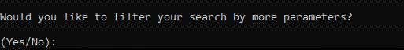

# Description
This application parses and stores course data from the [University of Guelph Course Descriptions](https://www.uoguelph.ca/registrar/calendars/undergraduate/current/pdffiles/c12.pdf). Providing the ability to search through courses by categories like weight, level, department, etc.

To start off, please see the [Data Set Generation](#Data-Set-Generation) Page

# Table of Contents
[Data Set Generation](#Data-Set-Generation)  \
[Running the Application](#Running-the-Application)  \
[User Interface](#User-Interface)  \
[Gephi Graph Generation](#Gephi-Graph-Generation)  \
[Gitlab Pipeline](#Gitlab-Pipeline)  \
[Export CSV for Giphy](#Export-CSV-for-Giphy)  \
[Code Coverage Reporting](#Code-Coverage-Report-Creation) \
[FAQ](#FAQ) \
[API Documentation](#API-Documentation) \
[Running the site](#Running-the-site) \
[Front End Mockups](#Frontend-UI-Mockups) \
[Running, Installing, and Configuring the Backend](#Backend-Configuration) \
[Usability Documentation](#Usability-Documentation)


# Data Set Generation
In order to provide this application with the appropriate data, you must go to the [University of Guelph Undergraduate Calendar - Course Descriptions](https://www.uoguelph.ca/registrar/calendars/undergraduate/current/c12/index.shtml) section. There, you can press the PDF button to download the entire dataset.

In order to provide the dataset to the application, you must convert the PDF to text using a third-party application called pdftotext. Through trial and error we have determined that the implementation for pdftotext is SYSTEM DEPENDENT. The cleanest conversion is possible through the Mac OS version of the application. To install the pdftotext application, run `brew install --cask pdftotext` in your terminal.

Once installed, you can run the following command on your pdf file: `pdftotext <inputfile.pdf> <outputfile.txt>` without any command-line arguments (i.e. `-layout` is not needed).

You should now have a text document that contains all the data necessary to run the application. Next, go to the section titled [Running the Application](#Running-the-Application)


# Running the Application
Now that have the proper file with the correct data set.
1. Download the project from the repository. 
2. Ensure that you have python installed, if not follow this link: https://www.python.org/downloads/
3. Ensure you have the requests library installed (sudo pip3 install requests)
4. Ensure you have the beautiful soup library installed (sudo pip3 install beautifulsoup4)
5. With the application, python and libraries installed you are now ready to run this application. 
6. cd into the root of the project directory and enter in the command line "py main.py" or you can "./scripts/run_app.sh"
7. Congratulations now you are ready to use the application!

# User Interface
# Input
The program will provide different numbered search options. The user will provide the number and hit enter to run the search they desire. 

# Output
The output to the program will be a list of the results that match the searches requirements.

# Search
Search is performed on a query by query basis

The following search types are available
- Search by Course Weight
- Search by Department
- Search by Course Code
- Search by Semester
- Search by Course Level
- Search by Full Course Code
- Search by Availability
- Search by Faculty 
- Check dropped courses
- Check current semester courses not being offered
- Search by Capacity Maximum
- Search by Capacity Minimum


# Example:
Lets go through a use case. 

We'll start with looking for courses based on their weight.


Now options are shown for the varying weights.


After selecting weight the program will give you an option to further filter your search parameters, if you want to add to your search enter yes, otherwise enter no



We will add to the search by selecting department then selecting 17 for Computer and Information Science. 


Then we will select No to finish the query. Next we will be asked if we would like to export the data, with 3 options, 1 for no, 2 if you want to export all course data (unrelated to your query), and 3 exports all the data that matches your query


If you choose to export your query the csv files containing the data will be found in the `export/` folder, refer to the page [Gephi Graph Generation](#Gephi-Graph-Generation) for uses of the exported data

Once you have made your decision the search results of your query will be displayed, from here you can keep going or press 13 to quit.


# Gephi Graph Generation
Useful links

**Step 1 - Download Gephi**

Follow the download instructions here - https://gephi.org/

You may need to install Java 8 if you do not already have it.

**Step 2 - Ensure that you have a csv to import**

If you used the application and run a query prior. 

There should be a nodes and edges csv file in the /project/exports folder.

**Step 3 - Open Gephi + Import CSV File**

- Open a new project. 
- Go to the Data Laboratory Tab.
- Import your Nodes and Edge Spreadsheet
- Your result should look like something below


IF you go back to the Overview or Preview tab you should now see your graph laid out with all nodes and their corresponding edges. If you exported the entire Guelph Course Calendar, the default layout is almost incomprehensible due to the amount of of nodes and edges. 


**Step 4 - Customizing Your Graph**

Useful options to improve your graph. 

- Layouts - Choosing a layout will position the graph based on that layouts algorithm. Depending on the algorithm, there are specific setting that you can apply to change your graph. For example: Force Atlas 2 has a Prevent Overlap option.
- Appearance - You can change the color, size, text color, and label size for nodes and edges based on Partition (ie Department) or Ranking (ie Degrees). You can customize the color palette used for each partition to anything you desire.
- Preview Settings - You can decide to show labels, as well as shorten and outline them. You can adjust opacity and thickness of the edges and nodes. There is also an option to change the font. There is many more options, but those were the most relevant. 

**Step 5 - Using Your Graph**

In the Graph window is where you can play around with your newly created graph. If you hover over a node, it will highlight that node as well as the ones attached to it.


The bar below contains settings to toggle what you view. 


The side bar holds functions to move around the graph, edit nodes and show path ways. 


Important ones: 
- Hand: Right click to drag your view around the graph
- Any writing equipment is used to add nodes/edges or edit them
- Diamond: Resize Nodes
- Bucket: Change color
- Plane: Show shortest path

**Step 6 - Exporting**

You have a few options to export the graph with. You can export as a graph file (csv), png, pdf, and svg. If you imported all the courses in the calendar, I would recommend using SVG over pdf / png. This is due to the graph being so large.


# Gitlab Pipeline
This project contains a pipeline set up so that the applications unit tests will be run after a commit/before a merge so that we don't merge in any code that breaks tests.

To go the the pipelines click on `CI/CD -> Pipelines` in the left navigation

The code that the pipeline runs is contained in `.gitlab-ci.yml`

The job is located in the file under test-job, use the format
```
test-job-#:
  stage: test
  script:
    - script command
```
if you want to add a new job.

To add new test cases to the existing job at the test file to the tests folder and begin the file name with `test_`

# Export CSV for Giphy
The CSVs gets created based on the search that happens while running the application, to export the CSV follow the instructions to run the application found at [Running the Application](#Running-the-Application)

After the application has been run the CSVs will be found in the `exports/` folder

To find follow up steps after the CSVs have been exported navigate to [Gephi Graph Generation](#Gephi-Graph-Generation)


# Code Coverage Report Creation
To create code coverage HTML files run the following commands:

1. `pip install coverage`
2. `coverage run -m unittest discover`
3. `coverage html`

To view the coverage results, go to the `htmlcov/` directory and open `index.html`

# FAQ
**Common Errors - Course Description Analysis**

**Can't run the application**
- Make sure to run the script file `run_app.sh` from the root directory. Please see the [Running the Application](#Running-the-Application) page

**Can't run the test file**
- Make sure to run the script file `run_tests.sh` from the root directory.

**Invalid file name, please try again**

Things to consider: 
- Did you generate the proper data set? 
- Ensure that your input includes the file type extension ie "course-descriptions.txt"
- Check to see if the data set is in the "data" folder 

**Not entering a valid option**

Numbered options will be provided. If the user does not enter a valid option, the program will keep asking until a valid option is entered. 

**Common Errors - Gephi**

If window does not appear or load. You may need to close said window and reopen or close gephi entirely.

# API Documentation
## Search

| URI              |  HTTP Verb   | Action       | Parameters | Status Codes |
| :-------------   | :----------  | :----------- | :--------- | :-------- |
| /find/{category} | GET          | Finds courses with a given category    | term (the value for the category) | 200 - Success <br> 400 - Bad Request, failure to provide correct parameters|
| /multi/combine   | PUT          | Set up for a combine multisearch | N/A | 200 - Success |
| /multi/filter    | PUT          | Set up for a filter multisearch  | N/A | 200 - Success |


#### Find Categories
| Category                  | Valid Terms     |
| :------------------------ | :-------------- |
| weight                    | "0.25" <br> "0.50" <br> "0.75" <br> "1" |
| department                | "ACCT" <br> "AGR" <br> "BIOM" <br> "ANSC" <br> "ANTH" <br> "ARAB" <br> "ARTH" <br> "ASCI" <br> "BIOC" <br> "BIOL" <br> "BIOM" <br> "BOT" <br> "BUS" <br> "CHEM" <br> "CHIN" <br> "CLAS" <br> "CIS" <br> "COOP" <br> "CROP" <br> "CTS" <br> "ECON" <br> "EDRD" <br> "ENGG" <br> "ENGL" <br> "ENVM" <br> "ENVS" <br> "EQN" <br> "EURO" <br> "XSEN" <br> "FIN" <br> "FRHD" <br> "FARE" <br> "FOOD" <br> "FREN" <br> "GEOG" <br> "GERM" <br> "GREK" <br> "HIST" <br> "HORT" <br> "HTM" <br> "HROB" <br> "HK" <br> "HUMN" <br> "INDG" <br> "IPS" <br> "ISS" <br> "UNIV" <br> "IBIO" <br> "IDEV" <br> "ITAL" <br> "LARC" <br> "LAT" <br> "LING" <br> "MGMT" <br> "MCS" <br> "MATH" <br> "MICR" <br> "MCB" <br> "MBG" <br> "MUSC" <br> "NANO" <br> "NEUR" <br> "NUTR" <br> "OAGR" <br> "ONEH" <br> "PATH" <br> "BIOM" <br> "PHIL" <br> "PHYS" <br> "BIOM" <br> "PBIO" <br> "POLS" <br> "POPM" <br> "PORT" <br> "PSYC" <br> "REAL" <br> "SOC" <br> "SOAN" <br> "SPAN" <br> "STAT" <br> "SART" <br> "THST" <br> "TOX" <br> "VETM"<br>"WMST"<br>"ZOO" |
| code                      | Any number (e.g. 1500) |
| semester                  | "F" <br> "W" <br> "S" <br> "F,W" <br> "F,S" <br> "W,S" <br> "F,W,S" |
| level                     | 1 <br> 2 <br> 3 <br> 4 <br> 5 |
| full_course _code         | Full course code including asterisk (e.g. CIS*1500) |
| availability              | "open" <br> "closed" <br> "all" |
| faculty                   | Faculty Member (first and/or last name |
| dropped                   | Term not used            |
| not_in_current_semester   | Term not used            |
| capacity_maximum          | Any number               |
| capacity_minimum          | Any number               |


## Get Data
| URI              |  HTTP Verb   | Action       | Parameters | Status Codes |
| :-------------   | :----------  | :----------- | :--------- | :-------- |
| /get/faculty     | GET          |  Returns a list of all faculty members teaching this semester | N/A | 200 - Success |
| /get/allCourseCodes | GET | Returns a list of all courses offered at the University of Guelph | N/A | 200 - Success |
| /get/exportFiles | GET          | Returns a list of all saved export files (for getting specific export data | N/A | 200 - Success |
| /get/nodes       | GET          | Returns a list of all nodes and their information from the provided filename  | term (filename with or without Nodes prefix and Table.csv suffix) | 400 - File not provided <br> 404 - File not found <br> 200 - Success |
| /get/edges       | GET          | Returns a list of all edges (source and target) from the provided filename  | term (filename with or without Edges prefix and Table.csv suffix) | 400 - File not provided <br> 404 - File not found <br> 200 - Success |


## Scraping

| URI              |  HTTP Verb   | Action       | Parameters | Status Codes |
| :-------------   | :----------  | :----------- | :--------- | :----------- |
| /scrape          | PATCH        | Scrapes Webadvisor data if necessary (if a full day has passed, and reloads the data in the application | N/A | 201 - Scraped data and saved it <br> 204 - Data already exists, nothing needs to be scraped |


## Exporter
| URI              |  HTTP Verb   | Action       | Parameters | Status Codes |
| :-------------   | :----------  | :----------- | :--------- | :----------- |
| /export/{filename} | POST | Exports Webadvisor to a csv file named from a user input | N/A | 200 - Success <br> 428 - Precondition Required, no data to export because it requires a search to happen first|
| /exportNodes     | GET | Exports current search nodes and returns the data in JSON format | N/A | 200 - Success + JSON data |
| /exportEdges      | GET | Exports current search edges and returns the data in JSON format | N/A | 200 - Success + JSON data |


# Running the Site
Steps to run

1. On terminal cd to the front-end folder
2. run npm install
3. run npm start
4. view the app in http://localhost:3000/

# Frontend UI Mockups
React UI mockup: [Course Research Analysis Program](https://www.figma.com/file/9qNPzIimlZL83Ar4dRAVxv/CRAP)


# Backend Configuration
Please see the backend README:

[Running, Installing, and Configuring the Backend](../backend/README.md)

# Usability Documentation
## Initial Prompt Screen


**Home Button Icon**: Navigate to the Options Page \
**Enter Website**: Navigate to the Options Page \
**Hyperlink**: Navigate to the Github Wiki for more in depth information about the application

## Options Page 


**Search For Courses**: Navigate to the Course Search Page \
**View Graphs**: Navigate to the Graphs Page.
 
## Course Search 


The Course Search Page is used to find information about specific criteria based off the provided search metrics. Clicking on the boxes will highlight the box to indicate that you will be searching with that metric. You can apply as many of the presented metrics as you desire. Once you are satisfied with your search criteria hit the "Search" button below. 

**Metrics**
- Course Weight
- Departments
- Semester
- Levels
- Faculty
- Course Code
- Capacity 

The Search button will bring you to the page seen below. This is where you can specify what you will be searching for. 


Entering text in the field will autocomplete and provide you with the available options for that metric.


Once satisfied with the search criteria, hit search to observe your results.

## Results Page


Each course will provide information regarding it's Title, Course Code, Description, Department, Credit Weight, Prerequisites, and Status. 

## Data Uses
### Export Graph
After pressing Export Graph you will be brought to the graph page showing your previous Search results as a connected graph. See Image Below. \


### Combine Data 
Combine data will bring you back to the Search Course Page to add another Search Result to your previously done Search. \
For example: 
- Searching for Courses in CIS. 
- Combine Data.  
- Search for courses in ECON.

This will result in all courses within CIS and ECON. 


### Save Search
Selecting Save Search will bring you to the page seen below. This will prompt you for a file name for the previous search results.


After hitting Save Search, you will be provided with confirmation and an option to view your graph.


View Graph will bring you to the Graph Page with your recent Search Results. If you click the Dropdown Menu you will see all previously Saved Searches. 


## Graph Page


### Search For Courses
Navigate back to the Course Search Page


### Export From Recent Search
Refresh the Graph to show the most recent Search Result
### Export From File
Refresh the Graph to show the file that is shown in the Dropdown


## Search Panel Options


### Remove Filter
Clears all the selected panel options
### Apply Changes
Refreshes graph to show the results from the Panel Options

## Graph Features


Graph Node Colour is based off of Department. \
If a course is not available or not apart of the dataset it will be grey. \
You also have the option to drag the nodes to move them around. \
You can also hover over a node to see more detail about that course. See Image Below.


